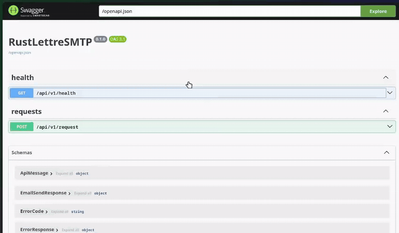

# REST SMPT-Microservice

## TODO: ADD link to gRPC branch

## Quickstart

1. Create `.env` file following `.env.example` or provide environment variables

2. Using Make run `make run` - to run in docker or using Cargo run `cargo run`, all Make commands are available in 📄 [docs/MAKE.md](docs/MAKE.md)

3. Docs available at:  
Swagger: /docs  
OpenAPI: /openapi.json  
Demo:

4. Test endpoints

## Notes

- Simple per-IP rate limiting (per hour). For production scale, consider an external store.
- Email sending is offloaded from the async reactor to avoid blocking.
- File log `email_sent.log` stores minimal metadata (recipient masked in app logs; file log omits body).
